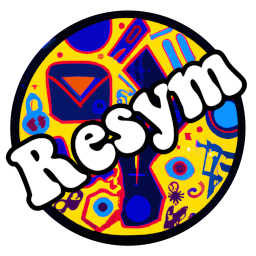
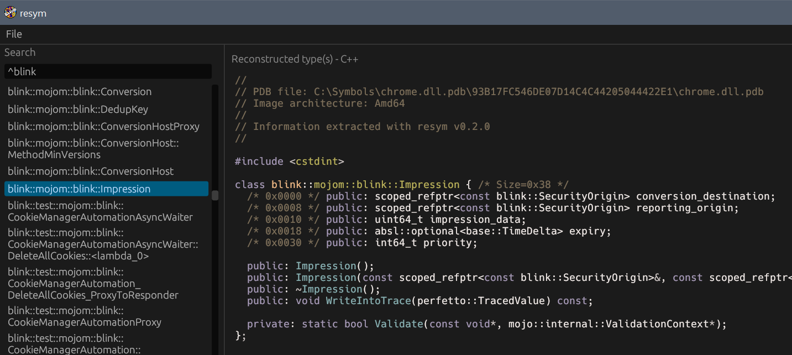

# resym [](https://img.shields.io/badge/license-Apache--2.0_OR_MIT-blue.svg) [](https://img.shields.io/badge/rust-1.75.0%2B-orange.svg) [](https://github.com/ergrelet/resym/actions?query=workflow%3ATests) [](https://coveralls.io/github/ergrelet/resym?branch=master) 

`resym` is a utility that allows browsing and extracting types from PDB files.

👉 [Click to run the web version](https://ergrelet.github.io/resym/) 👈

Inspired by [PDBRipper](https://github.com/horsicq/PDBRipper) and
[pdbex](https://github.com/wbenny/pdbex).

## Key Features

- Cross-platform (native and web)
- GUI and CLI versions available
- Decent performance, even on huge PDB files
- C and C++ types reconstruction
- C and C++ types diff generation (between two PDBs)
- Compilable output for C types (partial support for C++ types)
- PDB module browsing

## Screenshot



## How to Install

If you have Rust installed, you can easily install resym with `cargo`:

```
cargo install --git https://github.com/ergrelet/resym --tag v0.4.0
```

After that, you can invoke `resym` and `resymc` from anywhere, through the
command-line.

Keep in mind that you need to have the required dependencies installed for
`resym` to run properly. Check out the user documentation for more details.

## How to Use

If you want to use the GUI version, simply run the `resym` executable.  
A CLI version (named `resymc`) is also available:

```
resymc 0.4.0
resymc is a utility that allows browsing and extracting types from PDB files.

USAGE:
    resymc.exe <SUBCOMMAND>

FLAGS:
    -h, --help       Prints help information
    -V, --version    Prints version information

SUBCOMMANDS:
    diff            Compute diff for a type between two given PDB files
    diff-module     Compute diff for a module between two given PDB files
    dump            Dump type from a given PDB file
    dump-all        Dump all types from a given PDB file
    dump-module     Dump module from a given PDB file
    help            Prints this message or the help of the given subcommand(s)
    list            List types from a given PDB file
    list-modules    List modules from a given PDB file

```

## How to Build

On **Ubuntu**, you might need to install: `libxcb-shape0-dev`,
`libxcb-xfixes0-dev` and `libglib2.0-dev`.

```
git clone https://github.com/ergrelet/resym.git && cd resym
cargo build --release
./target/release/resym
```

## Know limitations

The GUI version might struggle to display huge outputs (>20 MB). Disabling
syntax highlighting (and/or dependency reconstruction altogether) will help but,
generally speaking, the CLI version is more suited when dumping types with a huge
amount of dependencies.

C++ namespaces and template types aren't reconstructed at the moment, which
means the reconstructed output for C++ types isn't necessarily compilable.

The web version cannot handle PDB files larger than ~2.1 GB due to how files
are accessed and the 32-bit limitations of `wasm32` targets. This might change
in the future with `wasm64`/`memory64` support.

## Why Another PDB Dumper?

I often need to extract and analyze C++ types from 1GB+ PDB files comfortably,
in an interactive manner, but I haven't been able to find a tool that ticks all
the boxes for me so far, so this my shot at making that tool.  
So if you're in the same boat, this tool might be of some use to you.
